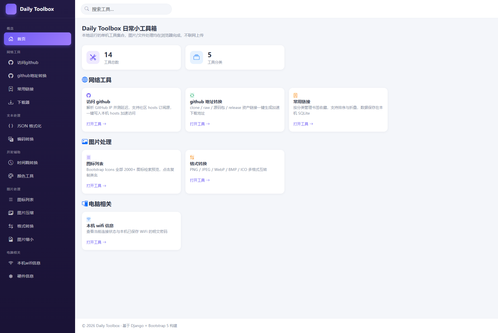

# Daily Toolbox 日常小工具箱

本地运行的个人 Web 工具箱：左侧导航、分类齐全的常用小工具集合。图片/文本处理均在浏览器本地完成，不联网上传；数据保存在本机 SQLite。

> 界面风格参考 [Majestic 主题](https://www.bootmb.com/themes/majestic/)，基于 Django + Bootstrap 5，所有第三方资源（Bootstrap、Bootstrap Icons）本地化存储，离线可用。



## 功能列表

### 网络工具
| 工具 | 说明 |
|---|---|
| 访问 github | 通过公共 DoH 解析 GitHub IP 并测延迟，支持 ineo6 / GitHub520 社区 hosts 订阅源，一键备份、写入本机 hosts 并刷新 DNS |
| github 地址转换 | clone / raw / 分支源码包 / release 资产链接一键生成加速前缀地址（gh-proxy 等 6 个镜像可切换） |
| 常用链接 | 书签收藏：分类管理、增删改查、分类与条目排序、折叠记忆，数据存 SQLite |
| 下载器 | 多线程分片下载（线程数 = CPU 核数 − 2）、断点续传、BT 种子 / 磁力链接（libtorrent）、任务持久化 |

### 文本处理
| 工具 | 说明 |
|---|---|
| JSON 格式化 | 校验、语法高亮、格式化（2/4 空格、Tab）与压缩，错误精确定位行列 |
| 编码转换 | URL / Base64 / Unicode / 十六进制 / HTML 实体 / ASCII 互转 + 8 种字符集乱码修复 |

### 开发辅助
| 工具 | 说明 |
|---|---|
| 时间戳转换 | 时间戳 ↔ 日期时间，自动识别秒/毫秒/微秒/纳秒精度，相对时间显示 | 
| 颜色工具 | HEX / RGB / HSL / HSV / CMYK 互转、取色器、色阶、配色方案、WCAG 对比度检查 | 

### 图片处理（全部浏览器本地处理）
| 工具 | 说明 |
|---|---|
| 图标列表 | Bootstrap Icons 2000+ 图标检索、实时过滤、点击复制类名 |
| 图片压缩 | 质量 / 最大宽度 / 输出格式（JPEG/WebP/PNG）三参数，批量处理 |
| 格式转换 | PNG / JPEG / WebP / BMP / ICO 多格式互转（含手写 BMP、多尺寸 ICO 编码器） |
| 图片缩小 | 按比例或指定宽/高等比缩小，保持原有格式，批量处理 |

### 电脑相关
| 工具 | 说明 |
|---|---|
| 本机 wifi 信息 | 当前连接状态 + 本机已保存 WiFi 的明文密码（netsh 读取） |
| 硬件信息 | CPU / 显卡（含显存寄存器级读取）/ 内存颗粒厂商识别 / 磁盘 / 主板 / 网络等 |


## 技术栈

- Python 3.12 / Django 5.2
- Bootstrap 5.3 + Bootstrap Icons 1.11（本地化，无 CDN 依赖）
- libtorrent（BT 下载）
- 数据库：SQLite（Django ORM）

## 快速开始

```powershell
# 1. 安装依赖（建议虚拟环境）
pip install -r requirements.txt

# 2. 初始化数据库
python manage.py migrate

# 3. 启动
```

**日常使用**：双击项目根目录 `start.bat`（自动启动服务并打开浏览器，默认 <http://127.0.0.1:8000/>）。

**开发调试**：

```powershell
python manage.py runserver
```

## 注意事项

- **修改 hosts 功能需管理员权限**：请右键 start.bat →"以管理员身份运行"，否则 hosts 写入会提示权限不足
- 下载的文件默认保存在 `~/Downloads/DailyToolbox/`
- hosts 修改前自动备份为 `hosts.toolbox.bak`，页面也可一键清除 github 相关记录
- 图片类工具（压缩/转换/缩小）纯前端 Canvas 实现，文件不会离开本机

